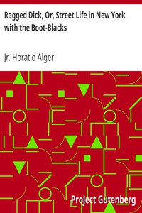

# Ragged Dick, Or, Street Life in New York with the Boot-Blacks <kbd>5348</kbd>

## Authors

 - Alger, Horatio, Jr. <small>(1832 - 1899)</small>

## Subjects

 - Bildungsromans
 - Boys -- Fiction
 - New York (N.Y.) -- Fiction
 - Poor children -- Fiction
 - Shoe shiners -- Fiction
 - Street children -- Fiction

## Download

 - https://www.gutenberg.org/files/5348/5348-h.zip
 - https://www.gutenberg.org/files/5348/5348-0.zip
 - https://www.gutenberg.org/files/5348/5348-h/5348-h.htm
 - https://www.gutenberg.org/cache/epub/5348/pg5348.cover.small.jpg
 - https://www.gutenberg.org/ebooks/5348.kindle.images
 - https://www.gutenberg.org/ebooks/5348.epub.images
 - https://www.gutenberg.org/ebooks/5348.rdf

## Book Shelves

 - Children's Fiction
