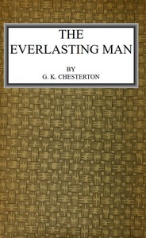

# The Everlasting Man <kbd>65688</kbd>

## Authors

 - Chesterton, G. K. (Gilbert Keith) <small>(1874 - 1936)</small>

## Subjects

 - Catholic Church -- Apologetic works
 - Christianity and other religions
 - Religion

## Download

 - https://www.gutenberg.org/files/65688/65688-0.zip
 - https://www.gutenberg.org/cache/epub/65688/pg65688.cover.small.jpg
 - https://www.gutenberg.org/files/65688/65688-h/65688-h.htm
 - https://www.gutenberg.org/files/65688/65688-0.txt
 - https://www.gutenberg.org/ebooks/65688.html.images
 - https://www.gutenberg.org/ebooks/65688.rdf
 - https://www.gutenberg.org/ebooks/65688.kindle.images
 - https://www.gutenberg.org/ebooks/65688.epub.images

## Book Shelves

