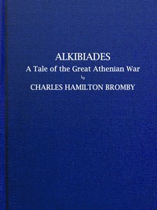

# Alkibiades, a tale of the Great Athenian War <kbd>67593</kbd>

## Authors

 - Bromby, Charles Hamilton <small>(1843 - 1904)</small>

## Subjects

 - Alcibiades -- Fiction
 - Greece -- History -- Peloponnesian War, 431-404 B.C. -- Fiction

## Download

 - https://www.gutenberg.org/ebooks/67593.rdf
 - https://www.gutenberg.org/ebooks/67593.kindle.images
 - https://www.gutenberg.org/ebooks/67593.epub.images
 - https://www.gutenberg.org/ebooks/67593.txt.utf-8
 - https://www.gutenberg.org/cache/epub/67593/pg67593.cover.medium.jpg
 - https://www.gutenberg.org/files/67593/67593-h/67593-h.htm
 - https://www.gutenberg.org/files/67593/67593-0.txt
 - https://www.gutenberg.org/files/67593/67593-0.zip

## Book Shelves

