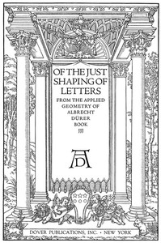

# Of the Just Shaping of Letters <kbd>37103</kbd>

## Authors

 - Dürer, Albrecht <small>(1471 - 1528)</small>

## Subjects

 - Alphabets
 - Lettering
 - Roman capitals (Lettering)

## Download

 - https://www.gutenberg.org/files/37103/37103-8.txt
 - https://www.gutenberg.org/files/37103/37103-h/37103-h.htm
 - https://www.gutenberg.org/files/37103/37103-page-images.zip
 - https://www.gutenberg.org/cache/epub/37103/pg37103.cover.medium.jpg
 - https://www.gutenberg.org/files/37103/37103.txt
 - https://www.gutenberg.org/ebooks/37103.html.images
 - https://www.gutenberg.org/ebooks/37103.epub.images
 - https://www.gutenberg.org/ebooks/37103.rdf
 - https://www.gutenberg.org/ebooks/37103.kindle.images
 - https://www.gutenberg.org/ebooks/37103.txt.utf-8

## Book Shelves

