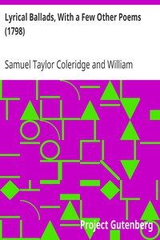

# Lyrical Ballads, With a Few Other Poems (1798) <kbd>9622</kbd>

## Authors

 - Coleridge, Samuel Taylor <small>(1772 - 1834)</small>
 - Wordsworth, William <small>(1770 - 1850)</small>

## Subjects

 - English poetry -- 18th century

## Download

 - https://www.gutenberg.org/files/9622/9622-0.zip
 - https://www.gutenberg.org/files/9622/9622-h.zip
 - https://www.gutenberg.org/files/9622/9622-h/9622-h.htm
 - https://www.gutenberg.org/cache/epub/9622/pg9622.cover.small.jpg
 - https://www.gutenberg.org/ebooks/9622.html.images
 - https://www.gutenberg.org/ebooks/9622.kindle.images
 - https://www.gutenberg.org/ebooks/9622.rdf
 - https://www.gutenberg.org/ebooks/9622.epub.images

## Book Shelves

 - Poetry
