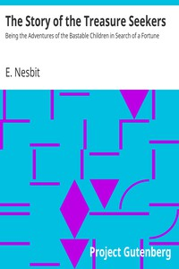

# The Story of the Treasure Seekers: Being the Adventures of the Bastable Children in Search of a Fortune <kbd>770</kbd>

## Authors

 - Nesbit, E. (Edith) <small>(1858 - 1924)</small>

## Subjects

 - Brothers and sisters -- Fiction
 - Family life -- England -- Fiction
 - Great Britain -- History -- 19th century -- Fiction
 - Imagination -- Fiction
 - Moneymaking projects -- Fiction

## Download

 - https://www.gutenberg.org/files/770/770.txt
 - https://www.gutenberg.org/files/770/770-h/770-h.htm
 - https://www.gutenberg.org/cache/epub/770/pg770.cover.medium.jpg
 - https://www.gutenberg.org/files/770/770.zip
 - https://www.gutenberg.org/ebooks/770.html.images
 - https://www.gutenberg.org/files/770/770-0.txt
 - https://www.gutenberg.org/ebooks/770.kindle.images
 - https://www.gutenberg.org/ebooks/770.rdf
 - https://www.gutenberg.org/ebooks/770.epub.images

## Book Shelves

 - Children's Fiction
 - Children's Literature
