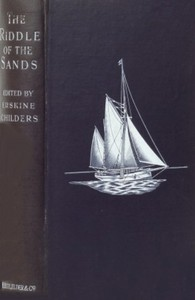

# The Riddle of the Sands <kbd>2360</kbd>

## Authors

 - Childers, Erskine <small>(1870 - 1922)</small>

## Subjects

 - Adventure stories
 - Alternative histories (Fiction)
 - Frisian Islands -- Fiction
 - Great Britain -- History -- Invasions -- Fiction
 - Sailing -- Fiction
 - Sea stories
 - Secret service -- Fiction
 - Spy stories

## Download

 - https://www.gutenberg.org/cache/epub/2360/pg2360.cover.medium.jpg
 - https://www.gutenberg.org/files/2360/2360-h/2360-h.htm
 - https://www.gutenberg.org/files/2360/2360-h.zip
 - https://www.gutenberg.org/ebooks/2360.html.images
 - https://www.gutenberg.org/files/2360/2360-0.txt
 - https://www.gutenberg.org/ebooks/2360.epub.images
 - https://www.gutenberg.org/ebooks/2360.rdf
 - https://www.gutenberg.org/ebooks/2360.kindle.images

## Book Shelves

