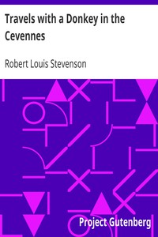

# Travels with a Donkey in the Cevennes <kbd>535</kbd>

## Authors

 - Stevenson, Robert Louis <small>(1850 - 1894)</small>

## Subjects

 - Authors, Scottish -- 19th century -- Biography
 - Cévennes Mountains (France) -- Description and travel
 - Stevenson, Robert Louis, 1850-1894 -- Travel -- France -- Cévennes Mountains

## Download

 - https://www.gutenberg.org/ebooks/535.html.images
 - https://www.gutenberg.org/cache/epub/535/pg535.cover.small.jpg
 - https://www.gutenberg.org/files/535/535.zip
 - https://www.gutenberg.org/files/535/535-h.zip
 - https://www.gutenberg.org/ebooks/535.kindle.images
 - https://www.gutenberg.org/ebooks/535.txt.utf-8
 - https://www.gutenberg.org/ebooks/535.rdf
 - https://www.gutenberg.org/ebooks/535.epub.images

## Book Shelves

