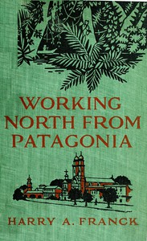

# Working North from Patagonia: Being the Narrative of a Journey, Earned on the Way, Through Southern and Eastern South America <kbd>55455</kbd>

## Authors

 - Franck, Harry Alverson <small>(1881 - 1962)</small>

## Subjects

 - South America -- Description and travel

## Download

 - https://www.gutenberg.org/cache/epub/55455/pg55455.cover.medium.jpg
 - https://www.gutenberg.org/files/55455/55455-0.zip
 - https://www.gutenberg.org/files/55455/55455-0.txt
 - https://www.gutenberg.org/ebooks/55455.html.images
 - https://www.gutenberg.org/files/55455/55455-h/55455-h.htm
 - https://www.gutenberg.org/ebooks/55455.rdf
 - https://www.gutenberg.org/ebooks/55455.kindle.images
 - https://www.gutenberg.org/ebooks/55455.epub.images

## Book Shelves

