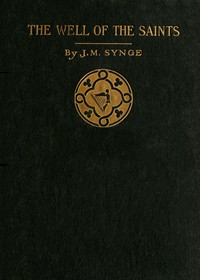

# The Well of the Saints: A Comedy in Three Acts <kbd>1241</kbd>

## Authors

 - Synge, J. M. (John Millington) <small>(1871 - 1909)</small>

## Subjects

 - Ireland -- Drama

## Download

 - https://www.gutenberg.org/files/1241/1241-h/1241-h.htm
 - https://www.gutenberg.org/cache/epub/1241/pg1241.cover.small.jpg
 - https://www.gutenberg.org/files/1241/1241-0.zip
 - https://www.gutenberg.org/files/1241/1241-0.txt
 - https://www.gutenberg.org/ebooks/1241.html.images
 - https://www.gutenberg.org/files/1241/1241.txt
 - https://www.gutenberg.org/ebooks/1241.rdf
 - https://www.gutenberg.org/ebooks/1241.epub.images
 - https://www.gutenberg.org/ebooks/1241.kindle.images

## Book Shelves

