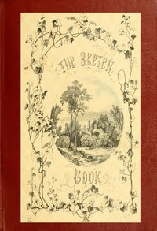

# The Sketch-Book of Geoffrey Crayon <kbd>2048</kbd>

## Authors

 - Irving, Washington <small>(1783 - 1859)</small>

## Subjects

 - Americans -- England -- History -- 19th century
 - Catskill Mountains Region (N.Y.) -- Fiction
 - England -- Social life and customs -- 19th century
 - Fantasy fiction, American
 - Hudson River Valley (N.Y. and N.J.) -- Fiction
 - Irving, Washington, 1783-1859 -- Travel -- England

## Download

 - https://www.gutenberg.org/files/2048/2048.zip
 - https://www.gutenberg.org/cache/epub/2048/pg2048.cover.small.jpg
 - https://www.gutenberg.org/files/2048/2048.txt
 - https://www.gutenberg.org/files/2048/2048-h/2048-h.htm
 - https://www.gutenberg.org/files/2048/2048-0.txt
 - https://www.gutenberg.org/ebooks/2048.html.images
 - https://www.gutenberg.org/ebooks/2048.rdf
 - https://www.gutenberg.org/ebooks/2048.epub.images
 - https://www.gutenberg.org/ebooks/2048.kindle.images

## Book Shelves

