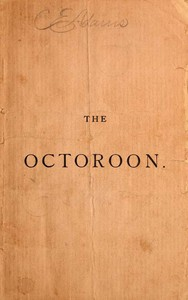

# The Octoroon; or, Life in Louisiana. A Play in Five acts <kbd>46091</kbd>

## Authors

 - Boucicault, Dion <small>(1820 - 1890)</small>

## Subjects

 - Louisiana -- Drama
 - Love -- Drama
 - Plantations -- Drama
 - Racially mixed women -- Drama
 - Slavery -- Drama
 - Slaves -- Drama

## Download

 - https://www.gutenberg.org/files/46091/46091.zip
 - https://www.gutenberg.org/files/46091/46091.txt
 - https://www.gutenberg.org/cache/epub/46091/pg46091.cover.small.jpg
 - https://www.gutenberg.org/files/46091/46091-h/46091-h.htm
 - https://www.gutenberg.org/ebooks/46091.html.images
 - https://www.gutenberg.org/ebooks/46091.kindle.images
 - https://www.gutenberg.org/ebooks/46091.txt.utf-8
 - https://www.gutenberg.org/ebooks/46091.rdf
 - https://www.gutenberg.org/ebooks/46091.epub.images

## Book Shelves

