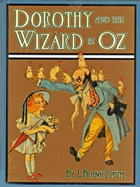

# Dorothy and the Wizard in Oz <kbd>22566</kbd>

## Authors

 - Baum, L. Frank (Lyman Frank) <small>(1856 - 1919)</small>

## Subjects

 - Cats -- Juvenile fiction
 - Cousins -- Juvenile fiction
 - Dragons -- Juvenile fiction
 - Earthquakes -- Juvenile fiction
 - Fantasy literature
 - Friendship -- Juvenile fiction
 - Gale, Dorothy (Fictitious character) -- Juvenile fiction
 - Kittens -- Juvenile fiction
 - Magic -- Juvenile fiction
 - Mountains -- Juvenile fiction
 - Nephews -- Juvenile fiction
 - Oz (Imaginary place) -- Juvenile fiction
 - Piglets -- Juvenile fiction
 - Ranches -- Juvenile fiction
 - Trials -- Juvenile fiction
 - Wizard of Oz (Fictitious character) -- Juvenile fiction

## Download

 - https://www.gutenberg.org/files/22566/22566.txt
 - https://www.gutenberg.org/files/22566/22566-h/22566-h.htm
 - https://www.gutenberg.org/cache/epub/22566/pg22566.cover.small.jpg
 - https://www.gutenberg.org/ebooks/22566.html.images
 - https://www.gutenberg.org/ebooks/22566.txt.utf-8
 - https://www.gutenberg.org/ebooks/22566.rdf
 - https://www.gutenberg.org/ebooks/22566.kindle.images
 - https://www.gutenberg.org/ebooks/22566.epub.images

## Book Shelves

 - Children's Literature
 - Fantasy
