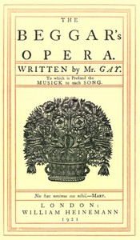

# The Beggar's Opera; to Which is Prefixed the Musick to Each Song <kbd>25063</kbd>

## Authors

 - Gay, John <small>(1685 - 1732)</small>

## Subjects

 - Ballad operas -- Librettos

## Download

 - https://www.gutenberg.org/files/25063/25063-h.zip
 - https://www.gutenberg.org/cache/epub/25063/pg25063.cover.small.jpg
 - https://www.gutenberg.org/files/25063/25063-8.zip
 - https://www.gutenberg.org/files/25063/25063-h/music/air_LXV.pdf
 - https://www.gutenberg.org/files/25063/25063-h/music/air_XLIII.ly
 - https://www.gutenberg.org/files/25063/25063.txt
 - https://www.gutenberg.org/files/25063/25063-h/music/air_XVIII.midi
 - https://www.gutenberg.org/ebooks/25063.html.images
 - https://www.gutenberg.org/files/25063/25063-h/25063-h.htm
 - https://www.gutenberg.org/ebooks/25063.txt.utf-8
 - https://www.gutenberg.org/ebooks/25063.epub.images
 - https://www.gutenberg.org/ebooks/25063.rdf
 - https://www.gutenberg.org/ebooks/25063.kindle.images

## Book Shelves

 - Opera
