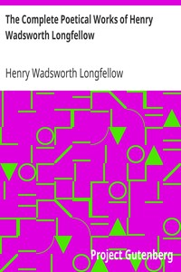

# The Complete Poetical Works of Henry Wadsworth Longfellow <kbd>1365</kbd>

## Authors

 - Longfellow, Henry Wadsworth <small>(1807 - 1882)</small>

## Subjects

 - American poetry

## Download

 - https://www.gutenberg.org/ebooks/1365.html.images
 - https://www.gutenberg.org/files/1365/1365-h.zip
 - https://www.gutenberg.org/cache/epub/1365/pg1365.cover.small.jpg
 - https://www.gutenberg.org/files/1365/1365-0.zip
 - https://www.gutenberg.org/ebooks/1365.kindle.images
 - https://www.gutenberg.org/ebooks/1365.rdf
 - https://www.gutenberg.org/ebooks/1365.epub.images

## Book Shelves

 - Bibliomania
 - Poetry
