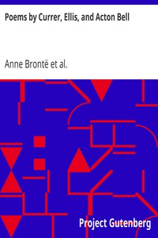

# Poems by Currer, Ellis, and Acton Bell <kbd>1019</kbd>

## Authors

 - Brontë, Anne <small>(1820 - 1849)</small>
 - Brontë, Emily <small>(1818 - 1848)</small>
 - Brontë, Charlotte <small>(1816 - 1855)</small>

## Subjects

 - English poetry -- 19th century

## Download

 - https://www.gutenberg.org/files/1019/1019-0.zip
 - https://www.gutenberg.org/files/1019/1019-h.zip
 - https://www.gutenberg.org/files/1019/1019-0.txt
 - https://www.gutenberg.org/ebooks/1019.html.images
 - https://www.gutenberg.org/cache/epub/1019/pg1019.cover.medium.jpg
 - https://www.gutenberg.org/ebooks/1019.rdf
 - https://www.gutenberg.org/ebooks/1019.epub.images
 - https://www.gutenberg.org/ebooks/1019.kindle.images

## Book Shelves

