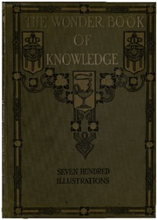

# The Wonder Book of Knowledge: The Marvels of Modern Industry and Invention, the Interesting Stories of Common Things, the Mysterious Processes of Nature Simply Explained <kbd>41111</kbd>

## Authors

## Subjects

 - Industrial arts -- History

## Download

 - https://www.gutenberg.org/files/41111/41111-0.zip
 - https://www.gutenberg.org/cache/epub/41111/pg41111.cover.medium.jpg
 - https://www.gutenberg.org/files/41111/41111-h/41111-h.htm
 - https://www.gutenberg.org/files/41111/41111-0.txt
 - https://www.gutenberg.org/ebooks/41111.html.images
 - https://www.gutenberg.org/ebooks/41111.kindle.images
 - https://www.gutenberg.org/ebooks/41111.rdf
 - https://www.gutenberg.org/ebooks/41111.epub.images

## Book Shelves

