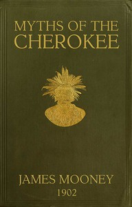

# Myths of the Cherokee: Extract from the Nineteenth Annual Report of the Bureau of American Ethnology <kbd>45634</kbd>

## Authors

 - Mooney, James <small>(1861 - 1921)</small>

## Subjects

 - Cherokee Indians -- Folklore
 - Cherokee Indians -- History
 - Cherokee mythology
 - Legends -- Southern States
 - Tales -- Southern States

## Download

 - https://www.gutenberg.org/files/45634/45634-h/45634-h.htm
 - https://www.gutenberg.org/cache/epub/45634/pg45634.cover.small.jpg
 - https://www.gutenberg.org/files/45634/45634-h.zip
 - https://www.gutenberg.org/files/45634/45634.txt
 - https://www.gutenberg.org/files/45634/45634-8.txt
 - https://www.gutenberg.org/ebooks/45634.html.images
 - https://www.gutenberg.org/ebooks/45634.kindle.images
 - https://www.gutenberg.org/ebooks/45634.txt.utf-8
 - https://www.gutenberg.org/ebooks/45634.rdf
 - https://www.gutenberg.org/ebooks/45634.epub.images

## Book Shelves

