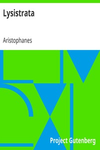

# Lysistrata <kbd>7700</kbd>

## Authors

 - Aristophanes <small>(-450 - -388)</small>

## Subjects

 - Aristophanes -- Translations into English
 - Comedies
 - Greece -- History -- Peloponnesian War, 431-404 B.C. -- Drama
 - Greek drama (Comedy) -- Translations into English
 - Lysistrata (Fictitious character) -- Drama
 - Peace movements -- Drama
 - Women and peace -- Drama

## Download

 - https://www.gutenberg.org/files/7700/7700-h/7700-h.htm
 - https://www.gutenberg.org/files/7700/7700.zip
 - https://www.gutenberg.org/cache/epub/7700/pg7700.cover.small.jpg
 - https://www.gutenberg.org/ebooks/7700.html.images
 - https://www.gutenberg.org/ebooks/7700.kindle.images
 - https://www.gutenberg.org/ebooks/7700.rdf
 - https://www.gutenberg.org/ebooks/7700.epub.images
 - https://www.gutenberg.org/ebooks/7700.txt.utf-8

## Book Shelves

 - Banned Books from Anne Haight's list
 - Classical Antiquity
