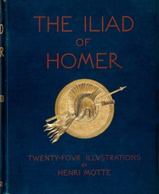

# The Iliads of Homer: Translated according to the Greek <kbd>51355</kbd>

## Authors

 - Homer <small>(-750 - -650)</small>

## Subjects

 - Achilles (Mythological character) -- Poetry
 - Epic poetry, Greek -- Translations into English
 - Trojan War -- Poetry

## Download

 - https://www.gutenberg.org/ebooks/51355.html.images
 - https://www.gutenberg.org/files/51355/51355-0.zip
 - https://www.gutenberg.org/cache/epub/51355/pg51355.cover.small.jpg
 - https://www.gutenberg.org/ebooks/51355.txt.utf-8
 - https://www.gutenberg.org/files/51355/51355-0.txt
 - https://www.gutenberg.org/ebooks/51355.rdf
 - https://www.gutenberg.org/ebooks/51355.epub.images
 - https://www.gutenberg.org/ebooks/51355.kindle.images

## Book Shelves

