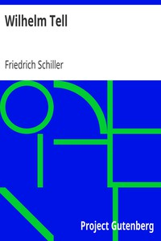

# Wilhelm Tell <kbd>6788</kbd>

## Authors

 - Schiller, Friedrich <small>(1759 - 1805)</small>

## Subjects

 - Tell, Wilhelm -- Drama

## Download

 - https://www.gutenberg.org/files/6788/6788-h/6788-h.htm
 - https://www.gutenberg.org/files/6788/6788-h.zip
 - https://www.gutenberg.org/files/6788/6788.txt
 - https://www.gutenberg.org/cache/epub/6788/pg6788.cover.medium.jpg
 - https://www.gutenberg.org/ebooks/6788.html.images
 - https://www.gutenberg.org/ebooks/6788.kindle.images
 - https://www.gutenberg.org/ebooks/6788.rdf
 - https://www.gutenberg.org/ebooks/6788.epub.images
 - https://www.gutenberg.org/ebooks/6788.txt.utf-8

## Book Shelves

 - Harvard Classics
 - Opera
