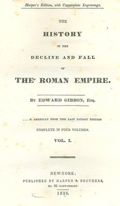

# The History of the Decline and Fall of the Roman Empire: Table of Contents with links in the HTML file to the two Project Gutenberg editions (12 volumes) <kbd>25717</kbd>

## Authors

 - Gibbon, Edward <small>(1737 - 1794)</small>

## Subjects

 - Byzantine Empire -- History -- To 527
 - Indexes
 - Rome -- History -- Empire, 30 B.C.-476 A.D.

## Download

 - https://www.gutenberg.org/cache/epub/25717/pg25717.cover.medium.jpg
 - https://www.gutenberg.org/files/25717/25717-h.zip
 - https://www.gutenberg.org/files/25717/25717-0.txt
 - https://www.gutenberg.org/files/25717/25717-h/25717-h.htm
 - https://www.gutenberg.org/ebooks/25717.epub.images
 - https://www.gutenberg.org/ebooks/25717.kindle.images
 - https://www.gutenberg.org/ebooks/25717.rdf

## Book Shelves

 - Banned Books from Anne Haight's list
