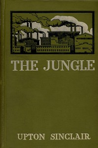

# The Jungle <kbd>140</kbd>

## Authors

 - Sinclair, Upton <small>(1878 - 1968)</small>

## Subjects

 - Chicago (Ill.) -- Fiction
 - Immigrants -- Fiction
 - Lithuanian Americans -- Fiction
 - Meat industry and trade -- Fiction
 - Political fiction
 - Stockyards -- Fiction
 - Working class -- Fiction

## Download

 - https://www.gutenberg.org/cache/epub/140/pg140.cover.small.jpg
 - https://www.gutenberg.org/files/140/140-h/140-h.htm
 - https://www.gutenberg.org/ebooks/140.html.images
 - https://www.gutenberg.org/files/140/140-0.txt
 - https://www.gutenberg.org/ebooks/140.kindle.images
 - https://www.gutenberg.org/ebooks/140.rdf
 - https://www.gutenberg.org/ebooks/140.epub.images

## Book Shelves

 - Banned Books List from the American Library Association
 - Banned Books from Anne Haight's list
 - Bestsellers, American, 1895-1923
 - Contemporary Reviews
