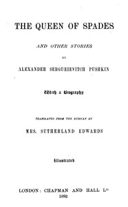

# The Queen of Spades, and other stories <kbd>55024</kbd>

## Authors

 - Pushkin, Aleksandr Sergeevich <small>(1799 - 1837)</small>

## Subjects

 - Pushkin, Aleksandr Sergeevich, 1799-1837 -- Translations into English
 - Russia -- Social life and customs -- Fiction
 - Russian fiction -- Translations into English
 - Short stories, Russian -- Translations into English

## Download

 - https://www.gutenberg.org/files/55024/55024-h/55024-h.htm
 - https://www.gutenberg.org/cache/epub/55024/pg55024.cover.medium.jpg
 - https://www.gutenberg.org/files/55024/55024-8.zip
 - https://www.gutenberg.org/files/55024/55024.txt
 - https://www.gutenberg.org/ebooks/55024.html.images
 - https://www.gutenberg.org/files/55024/55024-8.txt
 - https://www.gutenberg.org/ebooks/55024.rdf
 - https://www.gutenberg.org/ebooks/55024.kindle.images
 - https://www.gutenberg.org/ebooks/55024.epub.images
 - https://www.gutenberg.org/ebooks/55024.txt.utf-8

## Book Shelves

