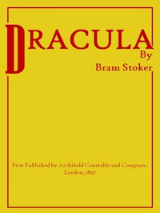

# Dracula <kbd>45839</kbd>

## Authors

 - Stoker, Bram <small>(1847 - 1912)</small>

## Subjects

 - Dracula, Count (Fictitious character) -- Fiction
 - Epistolary fiction
 - Gothic fiction
 - Horror tales
 - Transylvania (Romania) -- Fiction
 - Vampires -- Fiction
 - Whitby (England) -- Fiction

## Download

 - https://www.gutenberg.org/cache/epub/45839/pg45839.cover.medium.jpg
 - https://www.gutenberg.org/files/45839/45839.txt
 - https://www.gutenberg.org/files/45839/45839-h.zip
 - https://www.gutenberg.org/files/45839/45839-h/45839-h.htm
 - https://www.gutenberg.org/files/45839/45839-8.txt
 - https://www.gutenberg.org/ebooks/45839.html.images
 - https://www.gutenberg.org/ebooks/45839.kindle.images
 - https://www.gutenberg.org/ebooks/45839.rdf
 - https://www.gutenberg.org/ebooks/45839.epub.images
 - https://www.gutenberg.org/files/45839/45839-0.txt

## Book Shelves

