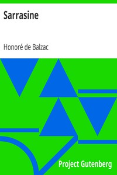

# Sarrasine <kbd>1826</kbd>

## Authors

 - Balzac, Honoré de <small>(1799 - 1850)</small>

## Subjects

 - Autobiographical fiction
 - French fiction -- Translations into English

## Download

 - https://www.gutenberg.org/files/1826/1826-h/1826-h.htm
 - https://www.gutenberg.org/files/1826/1826-h.zip
 - https://www.gutenberg.org/cache/epub/1826/pg1826.cover.medium.jpg
 - https://www.gutenberg.org/files/1826/1826.txt
 - https://www.gutenberg.org/ebooks/1826.html.images
 - https://www.gutenberg.org/files/1826/1826-0.txt
 - https://www.gutenberg.org/ebooks/1826.epub.images
 - https://www.gutenberg.org/ebooks/1826.rdf
 - https://www.gutenberg.org/ebooks/1826.kindle.images

## Book Shelves

