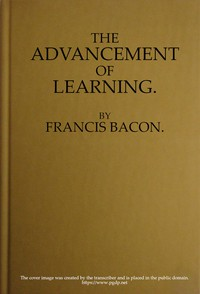

# The Advancement of Learning <kbd>5500</kbd>

## Authors

 - Bacon, Francis <small>(1561 - 1626)</small>

## Subjects

 - Knowledge, Theory of -- Early works to 1800
 - Learning -- Philosophy -- Early works to 1800
 - Logic -- Early works to 1800
 - Science -- Methodology -- Early works to 1800

## Download

 - https://www.gutenberg.org/files/5500/5500-h.zip
 - https://www.gutenberg.org/files/5500/5500-h/5500-h.htm
 - https://www.gutenberg.org/cache/epub/5500/pg5500.cover.medium.jpg
 - https://www.gutenberg.org/files/5500/5500-0.txt
 - https://www.gutenberg.org/ebooks/5500.txt.utf-8
 - https://www.gutenberg.org/ebooks/5500.kindle.images
 - https://www.gutenberg.org/ebooks/5500.epub.images
 - https://www.gutenberg.org/ebooks/5500.rdf

## Book Shelves

 - Banned Books from Anne Haight's list
