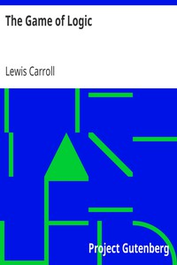

# The Game of Logic <kbd>4763</kbd>

## Authors

 - Carroll, Lewis <small>(1832 - 1898)</small>

## Subjects

 - Logic -- Juvenile literature
 - Logic, Symbolic and mathematical

## Download

 - https://www.gutenberg.org/cache/epub/4763/pg4763.cover.small.jpg
 - https://www.gutenberg.org/files/4763/4763.txt
 - https://www.gutenberg.org/files/4763/4763-h.zip
 - https://www.gutenberg.org/files/4763/4763-h/4763-h.htm
 - https://www.gutenberg.org/ebooks/4763.html.images
 - https://www.gutenberg.org/ebooks/4763.txt.utf-8
 - https://www.gutenberg.org/ebooks/4763.kindle.images
 - https://www.gutenberg.org/ebooks/4763.epub.images
 - https://www.gutenberg.org/ebooks/4763.rdf

## Book Shelves

 - Philosophy
