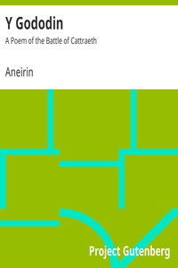

# Y Gododin: A Poem of the Battle of Cattraeth <kbd>9842</kbd>

## Authors

 - Aneirin <small>(null - null)</small>

## Subjects

 - Cattraeth, Battle of, Catterick, England, ca. 600 -- Poetry

## Download

 - https://www.gutenberg.org/files/9842/9842-h.zip
 - https://www.gutenberg.org/ebooks/9842.html.images
 - https://www.gutenberg.org/files/9842/9842.zip
 - https://www.gutenberg.org/cache/epub/9842/pg9842.cover.small.jpg
 - https://www.gutenberg.org/files/9842/9842-0.txt
 - https://www.gutenberg.org/ebooks/9842.rdf
 - https://www.gutenberg.org/ebooks/9842.kindle.images
 - https://www.gutenberg.org/ebooks/9842.epub.images

## Book Shelves

