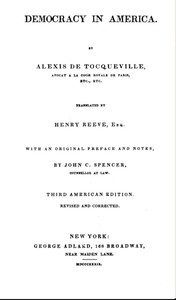

# Democracy in America — Volume 1 <kbd>815</kbd>

## Authors

 - Tocqueville, Alexis de <small>(1805 - 1859)</small>

## Subjects

 - Democracy -- United States
 - United States -- Politics and government
 - United States -- Social conditions

## Download

 - https://www.gutenberg.org/files/815/815-h.zip
 - https://www.gutenberg.org/files/815/815-h/815-h.htm
 - https://www.gutenberg.org/cache/epub/815/pg815.cover.medium.jpg
 - https://www.gutenberg.org/files/815/815-0.txt
 - https://www.gutenberg.org/ebooks/815.kindle.images
 - https://www.gutenberg.org/ebooks/815.txt.utf-8
 - https://www.gutenberg.org/ebooks/815.rdf
 - https://www.gutenberg.org/ebooks/815.epub.images

## Book Shelves

