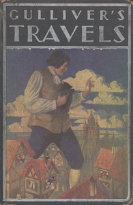

# Gulliver's Travels <kbd>65473</kbd>

## Authors

 - Swift, Jonathan <small>(1667 - 1745)</small>

## Subjects

 - Fantasy fiction
 - Gulliver, Lemuel (Fictitious character) -- Fiction
 - Satire
 - Travelers -- Fiction
 - Voyages, Imaginary -- Early works to 1800

## Download

 - https://www.gutenberg.org/files/65473/65473-h.zip
 - https://www.gutenberg.org/cache/epub/65473/pg65473.cover.medium.jpg
 - https://www.gutenberg.org/files/65473/65473-0.zip
 - https://www.gutenberg.org/ebooks/65473.html.images
 - https://www.gutenberg.org/ebooks/65473.epub.images
 - https://www.gutenberg.org/ebooks/65473.kindle.images
 - https://www.gutenberg.org/ebooks/65473.rdf

## Book Shelves

