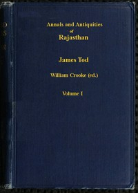

# Annals and Antiquities of Rajasthan, v. 1 of 3: or the Central and Western Rajput States of India <kbd>57374</kbd>

## Authors

 - Tod, James <small>(1782 - 1835)</small>

## Subjects

 - Rajasthan (India) -- History
 - Rajput (Indic people) -- History

## Download

 - https://www.gutenberg.org/files/57374/57374-h/57374-h.htm
 - https://www.gutenberg.org/files/57374/57374-0.txt
 - https://www.gutenberg.org/files/57374/57374-0.zip
 - https://www.gutenberg.org/cache/epub/57374/pg57374.cover.medium.jpg
 - https://www.gutenberg.org/ebooks/57374.html.images
 - https://www.gutenberg.org/ebooks/57374.rdf
 - https://www.gutenberg.org/ebooks/57374.epub.images
 - https://www.gutenberg.org/ebooks/57374.kindle.images

## Book Shelves

