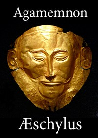

# The Agamemnon of Aeschylus: Translated into English Rhyming Verse with Explanatory Notes <kbd>14417</kbd>

## Authors

 - Aeschylus <small>(-525 - -456)</small>

## Subjects

 - Agamemnon, King of Mycenae (Mythological character) -- Drama

## Download

 - https://www.gutenberg.org/files/14417/14417-h/14417-h.htm
 - https://www.gutenberg.org/files/14417/14417-8.zip
 - https://www.gutenberg.org/files/14417/14417-h.zip
 - https://www.gutenberg.org/files/14417/14417-0.zip
 - https://www.gutenberg.org/cache/epub/14417/pg14417.cover.small.jpg
 - https://www.gutenberg.org/files/14417/14417.txt
 - https://www.gutenberg.org/ebooks/14417.html.images
 - https://www.gutenberg.org/ebooks/14417.epub.images
 - https://www.gutenberg.org/ebooks/14417.rdf
 - https://www.gutenberg.org/ebooks/14417.kindle.images

## Book Shelves

 - Classical Antiquity
 - Harvard Classics
