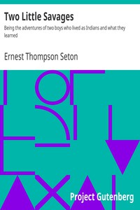

# Two Little Savages: Being the adventures of two boys who lived as Indians and what they learned <kbd>13499</kbd>

## Authors

 - Seton, Ernest Thompson <small>(1860 - 1946)</small>

## Subjects

 - Camping -- Juvenile fiction
 - Outdoor life -- Juvenile fiction

## Download

 - https://www.gutenberg.org/files/13499/13499.zip
 - https://www.gutenberg.org/files/13499/13499-h.zip
 - https://www.gutenberg.org/cache/epub/13499/pg13499.cover.medium.jpg
 - https://www.gutenberg.org/files/13499/13499.txt
 - https://www.gutenberg.org/files/13499/13499-8.txt
 - https://www.gutenberg.org/ebooks/13499.html.images
 - https://www.gutenberg.org/ebooks/13499.txt.utf-8
 - https://www.gutenberg.org/ebooks/13499.rdf
 - https://www.gutenberg.org/ebooks/13499.epub.images
 - https://www.gutenberg.org/ebooks/13499.kindle.images

## Book Shelves

 - Canada
