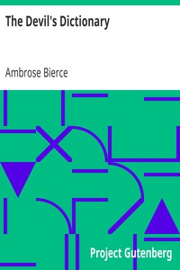

# The Devil's Dictionary <kbd>972</kbd>

## Authors

 - Bierce, Ambrose <small>(1842 - 1913)</small>

## Subjects

 - English language -- Dictionaries -- Humor
 - English language -- Semantics -- Humor
 - Vocabulary -- Humor

## Download

 - https://www.gutenberg.org/files/972/972-0.zip
 - https://www.gutenberg.org/cache/epub/972/pg972.cover.small.jpg
 - https://www.gutenberg.org/files/972/972-h/972-h.htm
 - https://www.gutenberg.org/ebooks/972.html.images
 - https://www.gutenberg.org/ebooks/972.kindle.images
 - https://www.gutenberg.org/ebooks/972.rdf
 - https://www.gutenberg.org/ebooks/972.epub.images

## Book Shelves

 - Humor
 - Reference
