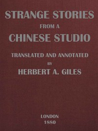

# Strange Stories from a Chinese Studio (Volumes 1 and 2) <kbd>43629</kbd>

## Authors

 - Pu, Songling <small>(1640 - 1715)</small>

## Subjects

 - China -- Social life and customs -- Fiction
 - Short stories, Chinese -- Translations into English

## Download

 - https://www.gutenberg.org/cache/epub/43629/pg43629.cover.small.jpg
 - https://www.gutenberg.org/files/43629/43629.zip
 - https://www.gutenberg.org/files/43629/43629.txt
 - https://www.gutenberg.org/ebooks/43629.html.images
 - https://www.gutenberg.org/files/43629/43629-8.txt
 - https://www.gutenberg.org/ebooks/43629.rdf
 - https://www.gutenberg.org/ebooks/43629.kindle.images
 - https://www.gutenberg.org/files/43629/43629-0.txt
 - https://www.gutenberg.org/files/43629/43629-h/43629-h.htm
 - https://www.gutenberg.org/ebooks/43629.epub.images

## Book Shelves

