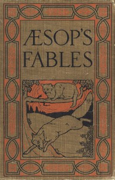

# Æsop's Fables: A Version for Young Readers <kbd>49010</kbd>

## Authors

 - Aesop <small>(null - null)</small>
 - Stickney, J. H. (Jenny H.) <small>(1840 - null)</small>

## Subjects

 - Fables -- Juvenile literature

## Download

 - https://www.gutenberg.org/files/49010/49010-0.txt
 - https://www.gutenberg.org/files/49010/49010-h/49010-h.htm
 - https://www.gutenberg.org/files/49010/49010-0.zip
 - https://www.gutenberg.org/cache/epub/49010/pg49010.cover.medium.jpg
 - https://www.gutenberg.org/ebooks/49010.html.images
 - https://www.gutenberg.org/ebooks/49010.epub.images
 - https://www.gutenberg.org/ebooks/49010.rdf
 - https://www.gutenberg.org/ebooks/49010.kindle.images

## Book Shelves

