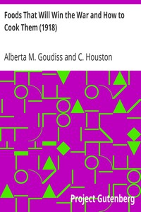

# Foods That Will Win the War and How to Cook Them (1918) <kbd>15464</kbd>

## Authors

 - Goudiss, Alberta M. (Alberta Moorhouse) <small>(1876 - null)</small>
 - Goudiss, C. Houston (Charles Houston) <small>(1880 - null)</small>

## Subjects

 - Cooking, American
 - Food conservation
 - Menus

## Download

 - https://www.gutenberg.org/files/15464/15464-8.zip
 - https://www.gutenberg.org/files/15464/15464-h/15464-h.htm
 - https://www.gutenberg.org/cache/epub/15464/pg15464.cover.medium.jpg
 - https://www.gutenberg.org/files/15464/15464-8.txt
 - https://www.gutenberg.org/files/15464/15464.txt
 - https://www.gutenberg.org/ebooks/15464.html.images
 - https://www.gutenberg.org/ebooks/15464.txt.utf-8
 - https://www.gutenberg.org/ebooks/15464.epub.images
 - https://www.gutenberg.org/ebooks/15464.rdf
 - https://www.gutenberg.org/ebooks/15464.kindle.images

## Book Shelves

 - Cookbooks and Cooking
 - World War I
