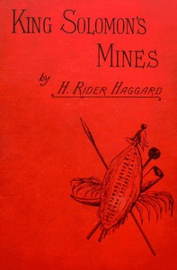

# King Solomon's Mines <kbd>2166</kbd>

## Authors

 - Haggard, H. Rider (Henry Rider) <small>(1856 - 1925)</small>

## Subjects

 - Adventure stories
 - Africa -- Fiction
 - Diamond mines and mining -- Fiction
 - Hunting guides -- Fiction
 - Missing persons -- Fiction
 - Quatermain, Allan (Fictitious character) -- Fiction
 - Treasure troves -- Fiction

## Download

 - https://www.gutenberg.org/cache/epub/2166/pg2166.cover.small.jpg
 - https://www.gutenberg.org/files/2166/2166-h.zip
 - https://www.gutenberg.org/files/2166/2166-h/2166-h.htm
 - https://www.gutenberg.org/ebooks/2166.html.images
 - https://www.gutenberg.org/files/2166/2166-0.txt
 - https://www.gutenberg.org/ebooks/2166.rdf
 - https://www.gutenberg.org/ebooks/2166.epub.images
 - https://www.gutenberg.org/ebooks/2166.kindle.images

## Book Shelves

 - Adventure
 - Best Books Ever Listings
 - Movie Books
