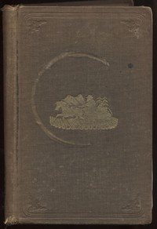

# Roughing It <kbd>3177</kbd>

## Authors

 - Twain, Mark <small>(1835 - 1910)</small>

## Subjects

 - Authors, American -- Homes and haunts -- West (U.S.)
 - Hawaii -- Description and travel
 - Twain, Mark, 1835-1910 -- Travel -- West (U.S.)
 - West (U.S.) -- Description and travel
 - West (U.S.) -- Intellectual life -- 19th century

## Download

 - https://www.gutenberg.org/files/3177/3177-h/3177-h.htm
 - https://www.gutenberg.org/files/3177/3177-0.zip
 - https://www.gutenberg.org/cache/epub/3177/pg3177.cover.small.jpg
 - https://www.gutenberg.org/ebooks/3177.txt.utf-8
 - https://www.gutenberg.org/files/3177/3177-0.txt
 - https://www.gutenberg.org/ebooks/3177.rdf
 - https://www.gutenberg.org/ebooks/3177.epub.images
 - https://www.gutenberg.org/ebooks/3177.kindle.images

## Book Shelves

 - Travel
