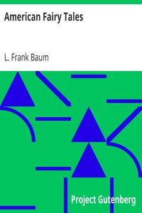

# American Fairy Tales <kbd>4357</kbd>

## Authors

 - Baum, L. Frank (Lyman Frank) <small>(1856 - 1919)</small>

## Subjects

 - Children's stories, American
 - Fairy tales
 - Fairy tales -- United States
 - Short stories

## Download

 - https://www.gutenberg.org/cache/epub/4357/pg4357.cover.small.jpg
 - https://www.gutenberg.org/files/4357/4357-h.zip
 - https://www.gutenberg.org/files/4357/4357-0.zip
 - https://www.gutenberg.org/files/4357/4357-h/4357-h.htm
 - https://www.gutenberg.org/files/4357/4357-0.txt
 - https://www.gutenberg.org/ebooks/4357.kindle.images
 - https://www.gutenberg.org/ebooks/4357.epub.images
 - https://www.gutenberg.org/ebooks/4357.txt.utf-8
 - https://www.gutenberg.org/ebooks/4357.rdf

## Book Shelves

 - Children's Literature
 - Children's Myths, Fairy Tales, etc.
