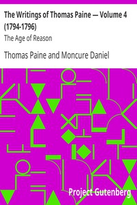

# The Writings of Thomas Paine — Volume 4 (1794-1796): The Age of Reason <kbd>3743</kbd>

## Authors

 - Paine, Thomas <small>(1737 - 1809)</small>

## Subjects

 - Philosophy and religion
 - Political science
 - Rationalism

## Download

 - https://www.gutenberg.org/files/3743/3743-0.txt
 - https://www.gutenberg.org/files/3743/3743-h.zip
 - https://www.gutenberg.org/cache/epub/3743/pg3743.cover.small.jpg
 - https://www.gutenberg.org/ebooks/3743.html.images
 - https://www.gutenberg.org/files/3743/3743-h/3743-h.htm
 - https://www.gutenberg.org/ebooks/3743.kindle.images
 - https://www.gutenberg.org/ebooks/3743.rdf
 - https://www.gutenberg.org/ebooks/3743.epub.images

## Book Shelves

 - Atheism
 - Banned Books from Anne Haight's list
