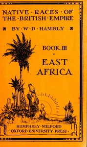

# The Native Races of East Africa <kbd>67513</kbd>

## Authors

 - Hambly, Wilfrid D. (Wilfrid Dyson) <small>(1886 - 1962)</small>

## Subjects

 - Indigenous peoples -- Africa, East

## Download

 - https://www.gutenberg.org/cache/epub/67513/pg67513.cover.small.jpg
 - https://www.gutenberg.org/files/67513/67513-0.zip
 - https://www.gutenberg.org/ebooks/67513.epub.images
 - https://www.gutenberg.org/ebooks/67513.rdf
 - https://www.gutenberg.org/ebooks/67513.kindle.images
 - https://www.gutenberg.org/ebooks/67513.txt.utf-8
 - https://www.gutenberg.org/files/67513/67513-0.txt
 - https://www.gutenberg.org/files/67513/67513-h/67513-h.htm

## Book Shelves

