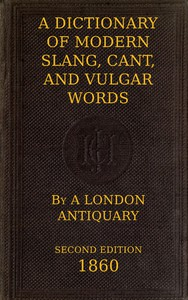

# A Dictionary of Slang, Cant, and Vulgar Words: Used at the Present Day in the Streets of London; the Universities of Oxford and Cambridge; the Houses of Parliament; the Dens of St. Giles; and the Palaces of St. James. <kbd>47018</kbd>

## Authors

 - Hotten, John Camden <small>(1832 - 1873)</small>

## Subjects

 - Cambridge (England) -- Languages -- Dictionaries
 - Cant -- Dictionaries
 - Cant -- England -- London -- Dictionaries
 - English language -- Dialects -- England -- London -- Glossaries, vocabularies, etc.
 - English language -- England -- London -- Slang -- Dictionaries
 - London (England) -- Languages -- Dictionaries
 - Oxford (England) -- Languages -- Dictionaries

## Download

 - https://www.gutenberg.org/files/47018/47018-0.zip
 - https://www.gutenberg.org/files/47018/47018-0.txt
 - https://www.gutenberg.org/cache/epub/47018/pg47018.cover.medium.jpg
 - https://www.gutenberg.org/ebooks/47018.html.images
 - https://www.gutenberg.org/files/47018/47018-h/47018-h.htm
 - https://www.gutenberg.org/ebooks/47018.epub.images
 - https://www.gutenberg.org/ebooks/47018.rdf
 - https://www.gutenberg.org/ebooks/47018.kindle.images

## Book Shelves

