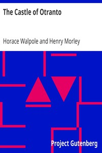

# The Castle of Otranto <kbd>696</kbd>

## Authors

 - Walpole, Horace <small>(1717 - 1797)</small>

## Subjects

 - Gothic fiction
 - Horror tales
 - Inheritance and succession -- Fiction

## Download

 - https://www.gutenberg.org/files/696/696-0.zip
 - https://www.gutenberg.org/ebooks/696.html.images
 - https://www.gutenberg.org/cache/epub/696/pg696.cover.small.jpg
 - https://www.gutenberg.org/files/696/696-0.txt
 - https://www.gutenberg.org/ebooks/696.kindle.images
 - https://www.gutenberg.org/ebooks/696.rdf
 - https://www.gutenberg.org/ebooks/696.epub.images

## Book Shelves

 - Gothic Fiction
