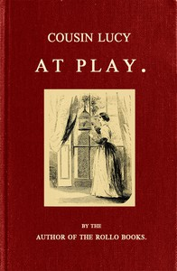

# Cousin Lucy at Play: By the Author of the Rollo Books <kbd>67689</kbd>

## Authors

 - Abbott, Jacob <small>(1803 - 1879)</small>

## Subjects

 - Amusements -- Juvenile fiction
 - Brothers and sisters -- Juvenile fiction
 - Children -- Conduct of life -- Juvenile fiction
 - Conduct of life -- Juvenile fiction
 - Games -- Juvenile fiction
 - Reading -- Juvenile fiction

## Download

 - https://www.gutenberg.org/ebooks/67689.txt.utf-8
 - https://www.gutenberg.org/cache/epub/67689/pg67689.cover.small.jpg
 - https://www.gutenberg.org/ebooks/67689.kindle.images
 - https://www.gutenberg.org/files/67689/67689-h.zip
 - https://www.gutenberg.org/ebooks/67689.html.images
 - https://www.gutenberg.org/ebooks/67689.epub.images
 - https://www.gutenberg.org/ebooks/67689.rdf
 - https://www.gutenberg.org/files/67689/67689-0.txt

## Book Shelves

