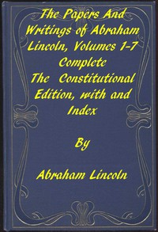

# The Papers and Writings of Abraham Lincoln, Complete <kbd>3253</kbd>

## Authors

 - Lincoln, Abraham <small>(1809 - 1865)</small>

## Subjects

 - Illinois -- Politics and government -- To 1865
 - Lincoln, Abraham, 1809-1865
 - Lincoln, Abraham, 1809-1865 -- Correspondence
 - Lincoln-Douglas Debates, Ill., 1858
 - United States -- History -- Civil War, 1861-1865
 - United States -- Politics and government -- 1829-1837
 - United States -- Politics and government -- 1837-1841
 - United States -- Politics and government -- 1841-1845
 - United States -- Politics and government -- 1845-1861
 - United States -- Politics and government -- 1861-1865

## Download

 - https://www.gutenberg.org/files/3253/3253-h.zip
 - https://www.gutenberg.org/files/3253/3253-h/3253-h.htm
 - https://www.gutenberg.org/cache/epub/3253/pg3253.cover.small.jpg
 - https://www.gutenberg.org/files/3253/3253-0.txt
 - https://www.gutenberg.org/ebooks/3253.txt.utf-8
 - https://www.gutenberg.org/ebooks/3253.kindle.images
 - https://www.gutenberg.org/ebooks/3253.rdf
 - https://www.gutenberg.org/ebooks/3253.epub.images

## Book Shelves

 - US Civil War
