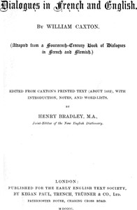

# Dialogues in French and English <kbd>29214</kbd>

## Authors

 - Caxton, William <small>(null - 1491)</small>

## Subjects

 - Dialogues, English (Middle)
 - Dialogues, French
 - English language -- Conversation and phrase books -- Early works to 1800
 - French language -- Conversation and phrase books -- Early works to 1800

## Download

 - https://www.gutenberg.org/files/29214/29214-0.zip
 - https://www.gutenberg.org/files/29214/29214-0.txt
 - https://www.gutenberg.org/cache/epub/29214/pg29214.cover.medium.jpg
 - https://www.gutenberg.org/files/29214/29214-h.zip
 - https://www.gutenberg.org/files/29214/29214-8.txt
 - https://www.gutenberg.org/files/29214/29214.txt
 - https://www.gutenberg.org/ebooks/29214.html.images
 - https://www.gutenberg.org/ebooks/29214.rdf
 - https://www.gutenberg.org/ebooks/29214.epub.images
 - https://www.gutenberg.org/ebooks/29214.kindle.images

## Book Shelves

 - Early English Text Society
