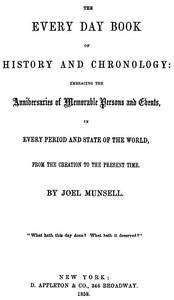

# The Every Day Book of History and Chronology: Embracing the Anniversaries of Memorable Persons and Events in Every Period and State of the World, from the Creation to the Present Time <kbd>44028</kbd>

## Authors

 - Munsell, Joel <small>(1808 - 1880)</small>

## Subjects

 - Chronology, Historical

## Download

 - https://www.gutenberg.org/files/44028/44028-8.zip
 - https://www.gutenberg.org/files/44028/44028-h/44028-h.htm
 - https://www.gutenberg.org/files/44028/44028-0.zip
 - https://www.gutenberg.org/cache/epub/44028/pg44028.cover.medium.jpg
 - https://www.gutenberg.org/files/44028/44028-8.txt
 - https://www.gutenberg.org/files/44028/44028.txt
 - https://www.gutenberg.org/ebooks/44028.kindle.images
 - https://www.gutenberg.org/ebooks/44028.rdf
 - https://www.gutenberg.org/ebooks/44028.epub.images

## Book Shelves

