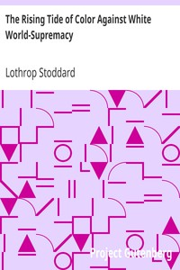

# The Rising Tide of Color Against White World-Supremacy <kbd>37408</kbd>

## Authors

 - Stoddard, Lothrop <small>(1883 - 1950)</small>

## Subjects

 - Caucasian race
 - Race relations

## Download

 - https://www.gutenberg.org/cache/epub/37408/pg37408.cover.medium.jpg
 - https://www.gutenberg.org/files/37408/37408-h.zip
 - https://www.gutenberg.org/files/37408/37408-8.zip
 - https://www.gutenberg.org/files/37408/37408.txt
 - https://www.gutenberg.org/ebooks/37408.html.images
 - https://www.gutenberg.org/ebooks/37408.txt.utf-8
 - https://www.gutenberg.org/ebooks/37408.kindle.images
 - https://www.gutenberg.org/ebooks/37408.epub.images
 - https://www.gutenberg.org/ebooks/37408.rdf

## Book Shelves

